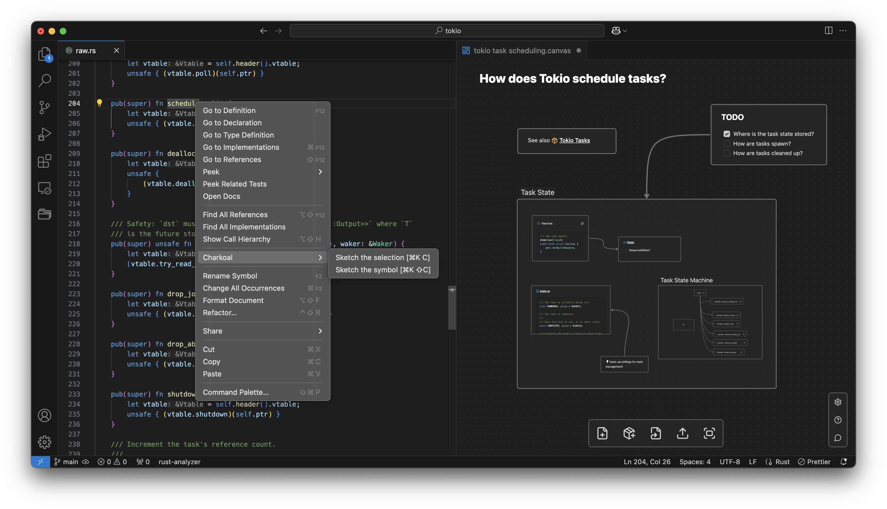
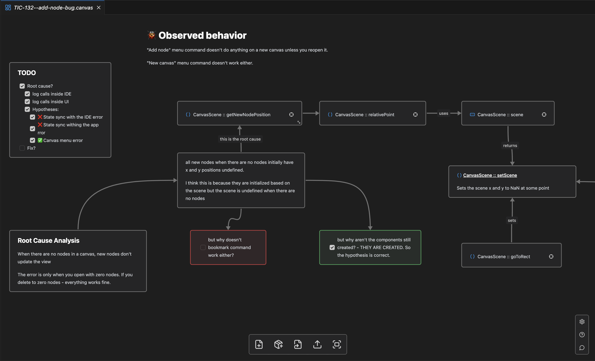

# Charkoal Canvas - Issues Repository

This is the public repository for Charkoal Canvas issues and bug tracking.

🔗 Important Links:

- [VS Code Marketplace](https://marketplace.visualstudio.com/items?itemName=Charkoal.charkoal)
- [Discord community](https://discord.gg/rQq5mjeaZm)
- [charkoal.dev](https://charkoal.ai)
- [JSON Canvas playground](https://jsoncanvas.charkoal.ai)

⚡ BETA ⚡: Charkoal is in early beta. Join our [Discord community](https://discord.gg/rQq5mjeaZm) to report bugs and shape the future!

Charkoal canvases are visual notes inside your IDE. They can be connected with any part of your code and with each other. Built to help you think about code.

## Getting Started

Charkoal Canvas is an infinite canvas where you can create nodes, edges, links to your code and other canvases.

After installing the extension, Charkoal provides you some commands to start with. You can:
- create a new empty canvas with the command ⁠ Charkoal: New Canvas ⁠ (Cmd/Ctrl + K,  N)
- select any piece of code or symbol and run ⁠ Charkoal: Sketch the Symbol/Selection (Cmd/Ctrl + Shift + K, S) from a context menu - to populate a canvas.

You can save and commit your canvas just like any other file.

## What can I do with Charkoal?

### Investigation board, but for developers 🕵️‍♂️

Keep all the pieces of information you need for your task in one place. Reveal code architecture, connect the dots, track your todo items and ideas.

### Capture code insights in 1 click without breaking the flow 🧘

Capture symbols, code locations and selections to your canvas with sketch commands without distractions.

### Break down complex ideas into manageable pieces 🔨

Split canvases, link and nest them to represent complex ideas and architectures.

### Code Canvas 🤝

Link any part of your code to your canvas. We support two types of links:
- **Node Links** - you can capture any code symbol or file to your canvas as a special node.
- **Text Links** - you can also reference any code symbol, or file or other canvas in your markdown text using `[[]]` notation. The autocomplete will suggest you options while typing.

### Share your insights with a team 📢

Canvases can be saved as files and committed to your repository. Charkoal canvas file format is a superset of a [JSON Canvas Spec](https://jsoncanvas.org/) (Obsidian open source canvas model).

## Supported Languages

Technically **we support all languages** that has its extension in VS code. But due to differences in LSP implementations there might be minor bugs for different languages.

Supported languages:
- All

Currently tested Languages:
- Typescript, Javascript
- ⁠Python
- ⁠Java, Scala
- ⁠Rust

## Call for Action! 📢

We're in beta now, and every week brings new improvements. But we need curious minds to help shape this tool. If you wish to say hi, feel free to join our [Discord community](https://discord.gg/rQq5mjeaZm).
